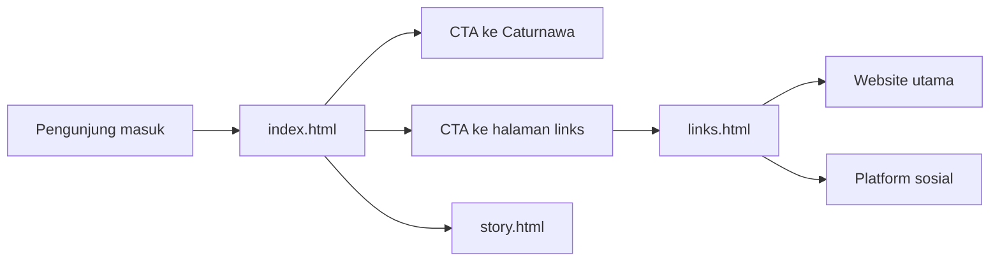
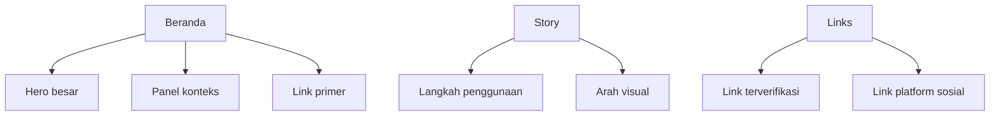
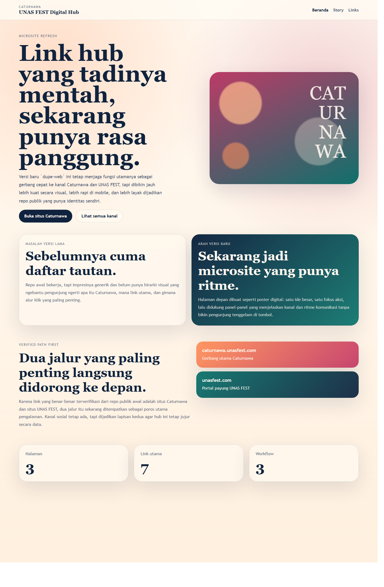
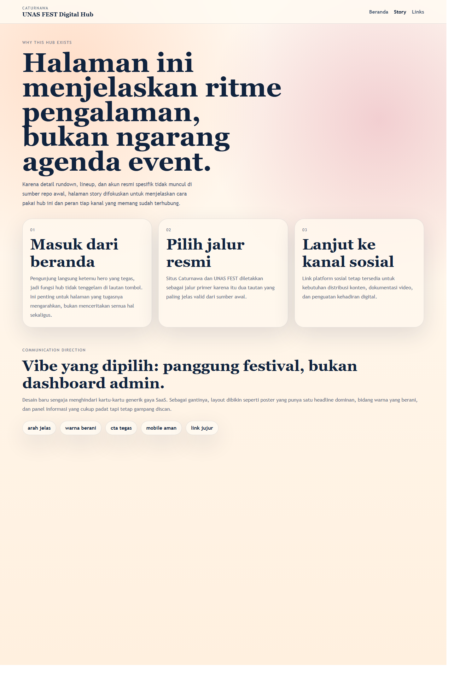
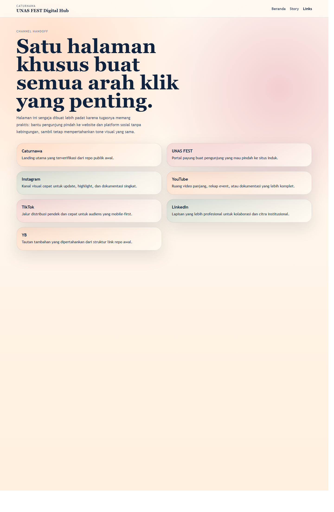

# dupe-web


`dupe-web` sekarang dirombak dari repo statis yang awalnya cuma berisi satu halaman link sederhana menjadi microsite Caturnawa UNAS FEST yang lebih matang secara visual, lebih jernih secara alur klik, dan lebih siap dijadikan repo publik yang proper. Repo publik awal cuma menampilkan judul, beberapa tautan, dan styling yang sangat minimal. Fungsi dasarnya memang jalan, tapi impresinya generik, belum ada hirarki yang nuntun pengunjung ke link paling penting, belum ada test, belum ada CI, belum ada rilis otomatis, dan belum ada README yang menjelaskan arah repo. Di versi baru ini, semua lapisan itu dibenerin tanpa menghilangkan inti utamanya: tetap menjadi hub yang mengarahkan pengunjung ke kanal Caturnawa dan UNAS FEST.

Hal yang paling penting dari perombakan ini adalah pendekatannya dibuat jujur. Link yang benar-benar bisa diverifikasi dari repo publik awal tetap diprioritaskan, terutama `caturnawa.unasfest.com` dan `unasfest.com`. Kanal sosial lain tetap disediakan sebagai jalur distribusi, tapi tidak dibumbui dengan klaim palsu tentang akun resmi yang tidak terverifikasi dari sumber awal. Jadi repo ini tidak cuma tampil lebih bagus, tapi juga lebih aman dari halu. Buat user yang tegas minta zero hallucination, ini krusial: desain boleh di-upgrade total, tapi fakta dasar tetap harus dijaga.

## Kenapa Repo Ini Perlu Di-improve

Versi awal repo punya tiga masalah besar:

1. Pengalaman visualnya terlalu tipis. Semua tautan diberi bobot yang hampir sama, jadi tidak ada arah klik yang jelas.
2. Branding-nya belum terasa. Halaman terasa seperti link tree generik, bukan microsite event yang punya karakter.
3. Belum ada infrastruktur repo yang layak. Tidak ada CI, tidak ada release, tidak ada README besar, dan tidak ada strategi metadata GitHub.

Kalau repo seperti itu langsung dipush terus ditinggal, hasilnya ya cuma halaman fungsional yang cepat dilupakan. Tujuan perombakan ini bukan sekadar mempercantik, tapi bikin repo punya identitas, alur, dan dokumentasi yang kuat. Dengan begitu, `dupe-web` bukan cuma halaman statis, tapi juga portofolio implementasi frontend ringan yang rapi.

## Arah Desain Versi Baru

Skill frontend yang dipakai di sini mendorong satu prinsip penting: halaman depan harus terasa seperti poster, bukan dashboard. Itu sebabnya hero di versi baru dibuat dengan headline besar, bidang warna kontras, komposisi yang lebih berani, dan hanya dua CTA utama. Satu CTA mengarah ke situs Caturnawa, satu lagi membuka halaman links. Dengan pola ini, pengunjung langsung paham fungsi situs tanpa perlu menebak-nebak.

Visual thesis yang dipakai untuk repo ini bisa diringkas begini: festival digital yang hangat, berani, dan gampang di-scan. Karena konteksnya adalah hub acara, layout dipilih agar terasa hidup, bukan seperti halaman admin. Warna peach, berry, teal, dan cream dipakai untuk membangun suasana yang enerjik tapi masih terasa rapi. Typography menggabungkan serif besar untuk headline dan sans-serif yang ringan untuk teks penjelas, supaya halaman punya rasa editorial tapi tetap mudah dibaca di layar kecil.

## Apa Saja yang Diubah

Perubahan repo ini bukan tempelan kecil. Struktur dan output-nya sekarang jauh lebih matang:

- `index.html` berubah jadi landing page dengan hero, panel konteks, jalur link primer, dan metrik repo.
- `story.html` ditambahkan untuk menjelaskan logika pengalaman pengguna tanpa mengarang detail event yang tidak ada di sumber.
- `links.html` ditambahkan sebagai halaman khusus yang menampung seluruh kanal klik penting dengan deskripsi fungsi masing-masing.
- `style.css` ditulis ulang total dengan layout responsif, atmosfer visual yang lebih kuat, dan struktur yang lebih terawat.
- `app.js` ditambahkan sebagai hook ringan untuk perilaku dasar.
- `scripts/lint.mjs` dibuat untuk quality gate halaman statis.
- `tests/site.test.mjs` dibuat supaya ada verifikasi otomatis terhadap navigasi silang dan jalur link yang penting.
- workflow GitHub Actions sekarang lengkap: CI, deploy Pages, dan release.
- README sekarang jadi dokumentasi utama yang menjelaskan konteks, struktur, cara pakai, dan arah repo.

## Snapshot Proyek

| Aspek | Nilai |
| --- | --- |
| Halaman publik | 3 |
| Link utama | 7 |
| Workflow GitHub | 3 |
| Test Node | 2 |
| Target deploy | GitHub Pages |
| Repo owner | adndaaryadi |

## Struktur Repo

```text
.
|-- .github/workflows/
|   |-- ci.yml
|   |-- pages.yml
|   `-- release.yml
|-- assets/screenshots/
|-- scripts/
|   |-- github_repo_metadata.ps1
|   `-- lint.mjs
|-- tests/
|   `-- site.test.mjs
|-- app.js
|-- index.html
|-- story.html
|-- links.html
|-- style.css
|-- LICENSE
`-- README.md
```

## Arsitektur Halaman

Walau repo ini statis dan kecil, arsitekturnya tetap dibuat sengaja:

- `index.html` bertugas jadi titik masuk utama. Di sini ada penjelasan bahwa repo sudah dirombak dari link sederhana ke microsite yang punya rasa panggung.
- `story.html` bertugas menjembatani konteks. Karena data event detail tidak tersedia di sumber awal, halaman ini dipakai untuk menjelaskan kenapa hub ini dibikin seperti ini, bagaimana alur pengunjungnya, dan apa peran tiap lapisan halaman.
- `links.html` bertugas sebagai halaman utilitarian. Ini tempat semua kanal ditempatkan dengan copy yang singkat dan gampang discan.

Pemisahan tiga halaman ini bikin repo punya ritme. Pengunjung yang cuma butuh klik cepat bisa langsung ke `links.html`. Pengunjung yang ingin ngerti konteks visual dan perubahan repo bisa lewat `index.html` dan `story.html`. Jadi satu repo bisa melayani kebutuhan cepat dan kebutuhan penjelasan tanpa campur aduk.

### Diagram Flow



### Diagram Struktur Konten



## Kenapa Halaman Story Penting

Biasanya repo kecil seperti ini tergoda untuk berhenti di satu halaman saja. Tapi user di task ini minta hasil yang rapat dan tidak menyederhanakan flow yang kelihatan sederhana. Karena itu, halaman story tidak dibuang. Justru halaman ini penting untuk menjaga repo tetap jujur. Di sana dijelaskan bahwa microsite ini tidak sedang pura-pura punya rundown atau lineup event yang lengkap. Yang dijelaskan adalah cara pakai hub, alasan memilih dua link primer, dan arah pengalaman yang dipakai.

Ini penting karena banyak redesign statis jatuh ke dua ekstrem: terlalu miskin konteks atau terlalu banyak ngarang isi. Versi baru `dupe-web` sengaja menghindari keduanya. Story page jadi pengaman yang menegaskan mana yang fakta, mana yang framing desain, dan kenapa keduanya dipisah.

## Kebijakan Link dan Validasi Fakta

Repo ini sengaja memprioritaskan link yang paling jelas berasal dari sumber awal:

- `https://caturnawa.unasfest.com/`
- `https://www.unasfest.com/`

Link ke Instagram, YouTube, TikTok, dan LinkedIn tetap ditampilkan karena memang sudah muncul di repo publik awal, tetapi tidak diberi label seolah-olah itu akun resmi tertentu kalau sumbernya tidak menegaskan begitu. Pendekatan ini bikin repo lebih bersih secara fakta. Buat microsite event, kejujuran seperti ini justru lebih penting daripada copy yang kelihatan meyakinkan tapi tidak punya dasar.

## Quality Gate yang Ditambahkan

Repo ini sekarang punya quality gate yang tadinya tidak ada sama sekali.

### Static lint

`scripts/lint.mjs` memastikan file inti ada, setiap halaman punya `<!doctype html>`, title, meta description, navigasi, dan tidak menyisakan placeholder seperti lorem ipsum. Selain itu, style wajib punya aturan `@media` sebagai tanda bahwa versi mobile tidak diabaikan.

### Node test

`tests/site.test.mjs` memeriksa dua hal yang sederhana tapi penting:

1. semua halaman punya navigasi silang ke seluruh halaman lain
2. halaman links tetap mempertahankan dua jalur yang memang paling terverifikasi dari repo awal

Test-nya ringan, tapi tepat sasaran untuk repo statis sekecil ini.

## CI/CD dan Release

Ada tiga workflow yang sekarang menempel di repo ini:

### 1. CI

Workflow `ci.yml` menjalankan static lint dan test Node di setiap push atau pull request ke `main`. Ini memastikan perubahan HTML/CSS/JS tidak cuma kelihatan rapi, tapi juga lolos pemeriksaan dasar secara otomatis.

### 2. Pages

Workflow `pages.yml` menyiapkan deploy GitHub Pages langsung dari isi repo. Karena seluruh situs ini murni statis, alurnya jadi ringan dan cocok buat repo kecil yang harus cepat tayang.

### 3. Release

Workflow `release.yml` membuat tag dan release otomatis di tiap push ke `main`. Dengan begitu, repo ini memenuhi permintaan user untuk punya versi/tagging dan latest release yang terus bergerak mengikuti perubahan baru.

## Metadata Repo GitHub

Supaya deskripsi dan topik repo tidak perlu diubah manual lewat UI GitHub tiap saat, repo ini ditambah `scripts/github_repo_metadata.ps1`. Script ini membaca token dari environment variable `GITHUB_TOKEN`, bukan dari source code. Jadi kredensial tetap aman.

Topik yang disiapkan untuk repo ini:

- `static-site`
- `landing-page`
- `event-hub`
- `github-pages`
- `frontend`
- `caturnawa`
- `unas-fest`

Contoh dry run:

```powershell
& .\scripts\github_repo_metadata.ps1 -DryRun
```

Dengan cara ini, deskripsi repo, homepage Pages, dan topics sudah terdokumentasi di dalam repo tanpa mengekspos token.

## Screenshot Halaman

### Beranda



### Story



### Links



## Cara Menjalankan Lokal

Tidak ada dependency eksternal yang wajib diinstall di repo ini selain Node yang dipakai untuk lint dan test.

### Jalankan lint

```bash
node scripts/lint.mjs
```

### Jalankan test

```bash
node --test tests/*.test.mjs
```

### Preview cepat

Kamu bisa langsung buka file HTML di browser:

- `index.html`
- `story.html`
- `links.html`

Atau pakai server statis sederhana:

```bash
python -m http.server 8080
```

Lalu akses `http://localhost:8080/`.

## Dampak Perubahan terhadap Repo

Secara praktik, perombakan ini bikin repo naik kelas di empat sisi:

1. **UX lebih jelas**  
   Pengunjung sekarang langsung tahu jalur utama dan fungsi microsite dari layar pertama.

2. **Visual lebih berkarakter**  
   Dari yang tadinya generik dan nyaris seperti link tree tempelan, sekarang tampil sebagai microsite dengan suasana yang lebih khas.

3. **Repo lebih maintainable**  
   Ada lint, ada test, ada workflow, ada metadata script, dan ada README yang benar-benar menjelaskan repo.

4. **Lebih aman dari miss fakta**  
   Link yang diprioritaskan adalah link yang memang paling mudah diverifikasi dari sumber awal.

## Checklist Perbaikan yang Sudah Masuk

Supaya gampang diaudit lagi nanti, berikut checklist konkret yang sudah benar-benar masuk ke repo ini:

- baseline repo publik direkonstruksi dulu sebelum dirombak, jadi ada jejak titik awalnya
- landing page dipecah jadi tiga halaman dengan tugas masing-masing
- navigasi silang dibikin konsisten di seluruh halaman
- layout dibuat mobile-friendly lewat breakpoint CSS, bukan cuma dibiarkan mengecil sendiri
- dua link yang paling terverifikasi dijadikan jalur primer di beranda
- lint statis dibuat untuk ngecek doctype, title, meta description, nav, dan placeholder
- test Node dibuat untuk mencegah miss navigasi dan miss link penting
- workflow CI, Pages, dan release sudah siap
- screenshot real tiap halaman sudah digenerate untuk dokumentasi
- metadata repo GitHub sudah didokumentasikan dalam script dry-run yang aman
- README disatukan jadi pusat dokumentasi supaya repo tidak pecah ke banyak file markdown

## Limitasi yang Masih Ada

Walau sekarang jauh lebih proper, repo ini tetap punya batas yang harus diakui:

- detail event seperti rundown, lineup, dan handle akun resmi tidak tersedia jelas di sumber repo awal
- karena itu, halaman-halaman repo sengaja tidak mengarang detail program atau nama akun
- link platform sosial masih bersifat jalur umum, bukan claim akun final
- repo ini fokus pada kualitas hub dan struktur frontend, bukan pada inventaris konten event yang belum diverifikasi

Justru dengan mengakui limitasi ini, repo jadi lebih sehat. Pengembangan berikutnya tinggal menambahkan data resmi yang lebih lengkap tanpa perlu bongkar fondasi desain dan workflow lagi.

## Roadmap Lanjutan

Kalau nanti sumber resmi Caturnawa sudah lebih lengkap atau akses GitHub dari mesin lokal sudah pulih total, ada beberapa langkah lanjutan yang masuk akal:

1. ganti link platform umum dengan handle resmi yang sudah terverifikasi
2. tambahkan blok countdown atau jadwal kalau data event benar-benar tersedia
3. sambungkan halaman links ke analytics ringan supaya jalur klik paling populer bisa dibaca
4. tambahkan varian asset visual seperti poster shareable atau og-image yang konsisten dengan microsite
5. pertimbangkan form pendaftaran atau kontak jika kebutuhan operasional acara memang mengarah ke sana

Dengan kata lain, repo ini sekarang bukan lagi link sederhana yang susah dibanggakan. Fondasinya sudah cukup kuat untuk ditumbuhkan jadi hub acara yang lebih hidup.

## Troubleshooting

### Lint gagal: "File wajib hilang"

Pastikan semua file inti ada di root: `index.html`, `story.html`, `links.html`, `style.css`, `app.js`. Lint script mengecek keberadaan file-file ini.

### Test gagal: navigasi silang

Test memverifikasi bahwa setiap halaman HTML punya link ke ketiga halaman. Pastikan setiap file HTML punya elemen `<nav>` dengan link ke `index.html`, `story.html`, dan `links.html`.

### Site tidak tampil di GitHub Pages

Pastikan workflow `pages.yml` aktif dan branch `main` sudah di-push. GitHub Pages deploy dari root directory (`.`).

## Kontributor

| Nama | Peran |
| --- | --- |
| Adinda Salsa Aryadi Putri | Owner repo dan target author GitHub |
| Codex local runtime | Rekonstruksi baseline, redesign microsite, penambahan test, workflow, screenshot, dan dokumentasi |

## Penutup

Improvement di repo ini bukan kosmetik doang. Yang tadinya cuma halaman tautan dengan gradien generik sekarang berubah jadi microsite yang punya hierarki, arah, dan disiplin repo yang jauh lebih proper. Semua itu tetap dikerjakan dengan batas yang jelas: tidak mengarang detail event yang tidak terlihat di sumber, tidak menyimpan token, dan tidak melewatkan lapisan-lapisan yang biasanya dianggap "terlalu simple" seperti test, release, README, atau metadata repo. Hasil akhirnya adalah repo statis yang kelihatan niat, mudah dicek, dan siap dipush begitu koneksi GitHub dari shell lokal sehat lagi.
